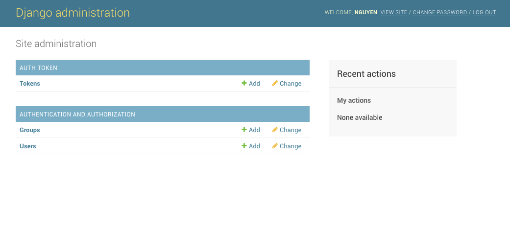

# Installation

## Procedure

### Prerequisites

This code was tested with Python 3.6.3

### Create a Virtual Environment

```bash
virtualenv env
```

#### Activating the virtual environment

```bash
source env/bin/activate
```

#### Deactivating the virtual environment

```bash
deactivate
```

### Install Django and Django-Rest-Framework

```bash
pip install Django
pip install djangorestframework
```

#### Record package installation in `requirements.txt` file

```bash
pip freeze -l > requirements.txt
```

If you open the `requirements.txt` file, you will see the following:

```bash
Django==2.1.2
djangorestframework==3.8.2
pytz==2018.5
```

You should update the `requirements.txt` file whenever you install a new package.

Also, make sure to add the `env/` directory to `.gitignore` if you are using Github or similar.

```bash
```

### Project Setup

```bash
django-admin.py startproject api .
```

```bash
cd api
django-admin.py startapp myapp
```

### File Structure

By running the following command, you can check the file structure of your project:

```bash
tree -I env
```

This will ignore the directory for the virtual environment.

Expected output:

```bash
django-rest
├── LICENSE
├── README.md
├── api
│   ├── api
│   │   ├── __init__.py
│   │   ├── __pycache__
│   │   │   ├── __init__.cpython-36.pyc
│   │   │   ├── settings.cpython-36.pyc
│   │   │   └── urls.cpython-36.pyc
│   │   ├── settings.py
│   │   ├── urls.py
│   │   └── wsgi.py
│   ├── myapp
│   │   ├── __init__.py
│   │   ├── admin.py
│   │   ├── apps.py
│   │   ├── migrations
│   │   │   └── __init__.py
│   │   ├── models.py
│   │   ├── tests.py
│   │   └── views.py
│   └── manage.py
├── docs
│   ├── README.md
│   └── installation.md
├── env
└── requirements.txt
```

### Add 'rest_framework' and 'myapp' to 'INSTALLED_APPS' in `api/settings.py`

```python
INSTALLED_APPS = [
    ...
    'rest_framework',
    'rest_framework.authtoken'  # for user authentication
    'myapp'  # name of your application
]
```

### Switch to from the default sqlite3 database to Postgres

```bash
pip install psycopg2
```

In `api/settings.py`, the value for `DATABASES` should be as follows

```python
DATABASES = {
    'default': {
        'ENGINE': 'django.db.backends.postgresql_psycopg2',
        'NAME': '<NAME_OF_DB>'
    }
}
```

You will want to install Postgres if you do not have it already.

```bash
brew install postgres
```

### Run your first migration
After adding the database values to `api/settings.py`, it's time to run the `migrate` command to initialize the database.

```bash
python manage.py migrate
```

Open Postgres in another tab and check to see that the database with your given name exists.

### Create a superuser

```bash
python manage.py createsuperuser --email admin@example.com --username admin
```

__This will prompt you to enter the password for the superuser.__

### Run the API to check out the progress

```python
python manage.py runserver
```

Run the command above and navigate to `localhost:8000/admin` in your browser to check out what you have so far. It should resemble the image below.



## References

1. [Let’s build an API with Django REST Framework — Part 1](https://medium.com/backticks-tildes/lets-build-an-api-with-django-rest-framework-32fcf40231e5)
2. [Let’s build an API with Django REST Framework — Part 2](https://medium.com/backticks-tildes/lets-build-an-api-with-django-rest-framework-part-2-cfb87e2c8a6c)
