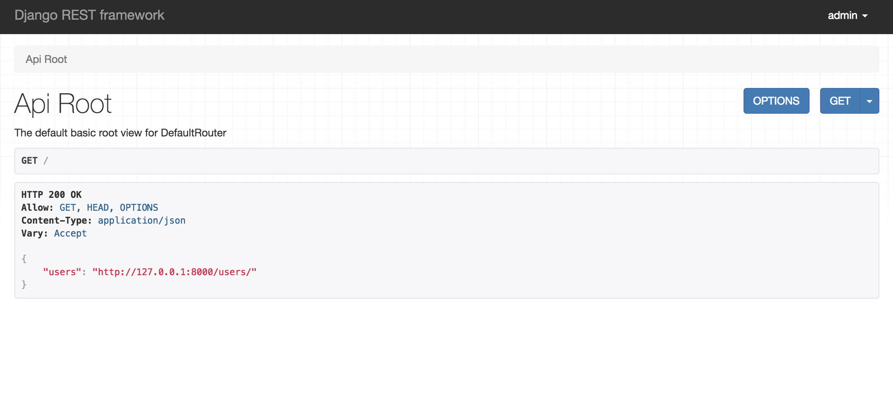
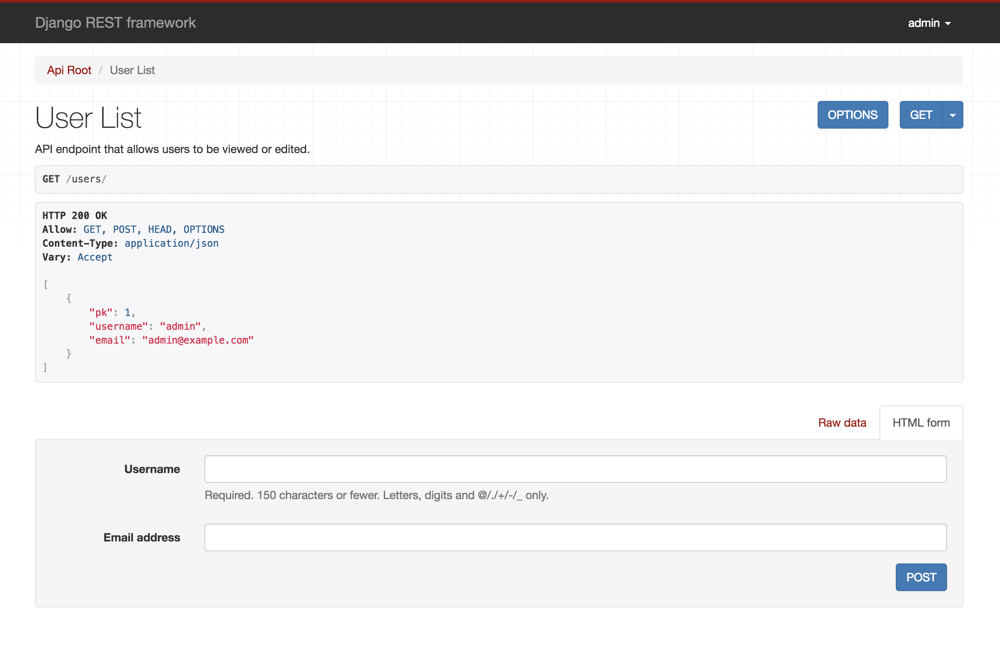
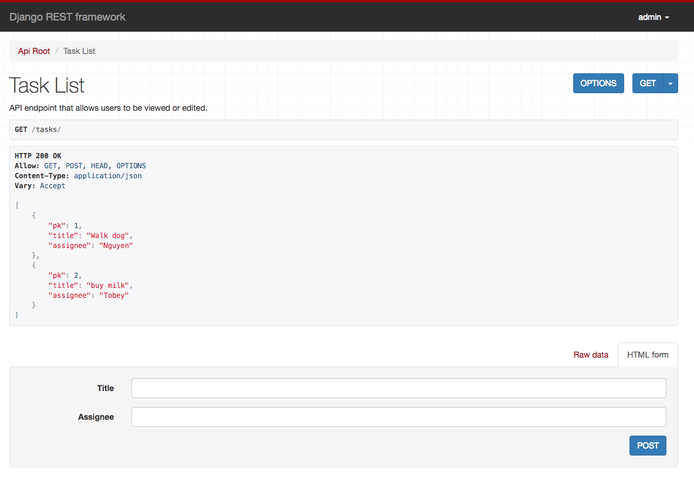

# Adding Endpoints

## Procedure

### Enabling the Users Endpoint

Users is a resource that is already built into Django REST Framework (DRF). To enable the users endpoint, we will be working with [ModelViewSets](https://www.django-rest-framework.org/api-guide/viewsets/#modelviewset) and [ModelSerializers](https://www.django-rest-framework.org/api-guide/serializers/#modelserializer).

__Warning: The examples below are implementing the shortcut methods for views and serializers. These methods are standard and can be found in the documentation, but may not be ideal if you are new to REST APIs.__

We will be adding code to the following files:

- `myapp/views.py`
- `myapp/serializers.py`
- `api/urls.py`

Your app name will probably be different from `myapp`, so make the substitutions as needed.

#### Example Code

```python
# in myapp/serializers.py
from rest_framework import serializers
from django.contrib.auth.models import User


class UserSerializer(serializers.ModelSerializer):
    class Meta:
        model = User
        fields = ('pk', 'username', 'email')
```

```python
# in myapp/views.py
from rest_framework import viewsets
from django.contrib.auth.models import User
from .serializers import UserSerializer


class UserViewSet(viewsets.ModelViewSet):
    """Users API Endpoint
    """
    queryset = User.objects.all()
    serializer_class = UserSerializer
```

```python
# in api/urls.py
from django.conf.urls import url, include
from rest_framework import routers
from myapp import views

router = routers.DefaultRouter()
router.register(r'users', views.UserViewSet)

urlpatterns = [
    url(r'^', include(router.urls)),
    url(r'^api-auth/',
        include('rest_framework.urls', namespace='rest_framework'))
]
```

So, what does the code above do in English?

1. We import `viewsets` and `serializers` from the `rest_framework` module. Remember that `rest_framework` was added to the `INSTALLED_APPS` list in the `api/api/settings.py` file.
2. We import the built-in `User` model from Django in both .
3. To create the `UserSerializer`, we set the model and the fields we would like to make available in the `Meta` class. See the [documentation on the built-in User model](https://docs.djangoproject.com/en/2.1/ref/contrib/auth/).
4. We import the `UserSerializer` from `serializers.py` into `views.py`.
5. To create the `UserViewSet`, we set the `serializer_class` to `UserSerializer` and set `queryset` to return all Users. Returning `<model_name>.objects.all()` seems to be typical for the `queryset` property. See [documentation on querysets](https://www.django-rest-framework.org/api-guide/relations/#the-queryset-argument). There are many ways to [filter](https://www.django-rest-framework.org/api-guide/filtering/) the objects that are returned that will be demonstrated later in this tutorial.
6. In `urls.py`, we are importing boilerplate Django objects (`url`, `include`, and `routers`). Then, we create a router and register the `/users` endpoint. For the `urlpatterns` list, we include the router urls and boilerplate authorization code. This authorization code will add a login button to the API. See the [documentation](https://www.django-rest-framework.org/tutorial/4-authentication-and-permissions/#adding-login-to-the-browsable-api).


#### Check your progress

In the main `api/` directory, run the following command in the terminal:

```bash
python manage.py runserver
```

You should see a page like this if you open up your browser and navigate to http://127.0.0.1:8000/.




If you click on the link for the users endpoint or navigate to http://127.0.0.1:8000/users, you will see the following page.



### Add Your Own Endpoint

For this example, I will be adding an endpoint for tasks that would populate a to-do list.

#### Add test code

Before we work on the actual endpoint, we will define the tests. This is a crucial step for test-driven development.

See documentation for [testing DRF](https://www.django-rest-framework.org/api-guide/testing/).

In the file, `myapp/tests.py`, add the following to the import block:

```python
from django.urls import reverse
from rest_framework.test import APITestCase, APIClient
from rest_framework.views import status
from .models import Task
from .serializers import TaskSerializer
```

Note that we are importing the `Task` model and `TaskSerializer` but we have not created them yet. The plan is to create tests that will check if our API is meeting the minimum requirements.

Below are two test classes that will check that our API can create tasks and return all tasks.

```python
# in myapp/tests.py
class BaseViewTest(APITestCase):
    client = APIClient()

    @staticmethod
    def create_task(title="", assignee=""):
        if title != "" and assignee != "":
            Tasks.objects.create(title=title, assignee=assignee)

    def setUp(self):
        # add test data
        self.create_task("walk dog", "Nguyen")
        self.create_task("buy milk", "Nguyen")
        self.create_task("call Mom", "Tobey")
        self.create_task("submit homework", "Nguyen")


class GetAllTasksTest(BaseViewTest):

    def test_get_all_tasks(self):
        """
        This test ensures that all tasks added in the setUp method
        exist when we make a GET request to the tasks/ endpoint
        """
        # hit the API endpoint
        response = self.client.get("/tasks/", format='json')

        # fetch the data from db
        expected = Task.objects.all()
        serialized = TaskSerializer(expected, many=True)
        self.assertEqual(response.data, serialized.data)
        self.assertEqual(response.status_code, status.HTTP_200_OK)
        self.assertIn(
            {'pk': 1, 'assignee': "Nguyen", 'title': "walk dog"},
            response.data)
```

The `BaseViewTest` class creates the tasks with the `setUp` method. The `GetAllTasksTest` class will make a `GET` request and check if the data returned is the same as the expected data. We will also check if the status code returned is 200 for OK.


#### Create the model for Task
In `api/myapp/models.py`:

```python
from django.db import models


class Task(models.Model):
    # task title and name of assignee
    title = models.CharField(max_length=255, null=False)
    assignee = models.CharField(max_length=255, null=False)

    class Meta:
        ordering = ('title',)
```

A `Task` object will have two fields, `title` and `assignee`.
The `Meta` class with the `ordering` property will store the objects as OrderedDicts and the list of dicts will be ordered by the `title` value.

#### Create the ModelSerializer for Tasks

Now that we created a model, we can import the `Task` model into `myapp/serializers.py`.

```python
from rest_framework import serializers
from django.contrib.auth.models import User
from .models import Task  # this line is new


class UserSerializer(serializers.ModelSerializer):
    class Meta:
        model = User
        fields = ('pk', 'username', 'email')


# this serializer class was added for tasks
class TaskSerializer(serializers.ModelSerializer):
    class Meta:
        model = Task
        fields = ('pk', 'title', 'assignee')
```

The `TaskSerializer` resembles the `UserSerializer` except the fields match that of the `Task` model.

#### Create a view for Tasks with ModelViewSet

Next, we will import the `Task` model as with as the `TaskSerializer` into `myapp/views.py`.

```python
from rest_framework import viewsets
from django.contrib.auth.models import User
from .serializers import UserSerializer, TaskSerializer  # TaskSerializer is new
from .models import Task  # this line is new


class UserViewSet(viewsets.ModelViewSet):
    """
    API endpoint that allows users to be viewed or edited.
    """
    queryset = User.objects.all()
    serializer_class = UserSerializer


# this viewset class was added for tasks
class TaskViewSet(viewsets.ModelViewSet):
    """
    API endpoint that allows users to be viewed or edited.
    """
    queryset = Task.objects.all()
    serializer_class = TaskSerializer
```

Again, the viewset for tasks resembles the viewset for users.

#### Add urls for the app

Lastly, we will add the `/tasks/` endpoint to our router in `api/urls.py`

```python
from django.conf.urls import url, include
from rest_framework import routers
from myapp import views

router = routers.DefaultRouter()
router.register(r'users', views.UserViewSet)
router.register(r'tasks', views.TaskViewSet)  # this line is new

urlpatterns = [
    url(r'^', include(router.urls)),
    url(r'^api-auth/',
        include('rest_framework.urls', namespace='rest_framework'))
]
```

#### Check Your Progress

In the main `api/` directory, run the following command in the terminal:

```bash
python manage.py runserver
```

You should see the following at the url http://127.0.0.1:8000/tasks



You can also run your test code by running the following:

```bash
python manage.py test
```

If the test is successful, the output in the terminal should look like this:
Â
```bash
$ python manage.py test
Creating test database for alias 'default'...
System check identified no issues (0 silenced).
.
----------------------------------------------------------------------
Ran 1 test in 0.019s

OK
Destroying test database for alias 'default'...
```

## References

1. [Django Rest Framework Documentation](https://www.django-rest-framework.org/)
2. [Classy Django REST Framework](http://www.cdrf.co/)
3. [Let’s build an API with Django REST Framework — Part 1](https://medium.com/backticks-tildes/lets-build-an-api-with-django-rest-framework-32fcf40231e5)
4. [Let’s build an API with Django REST Framework — Part 2](https://medium.com/backticks-tildes/lets-build-an-api-with-django-rest-framework-part-2-cfb87e2c8a6c)
